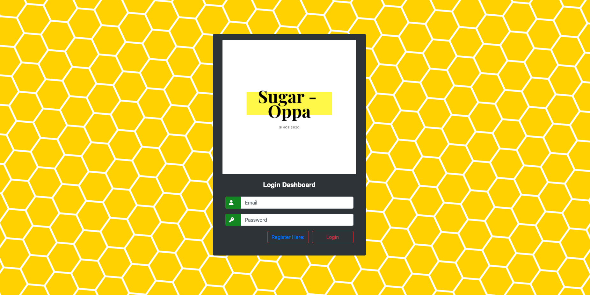
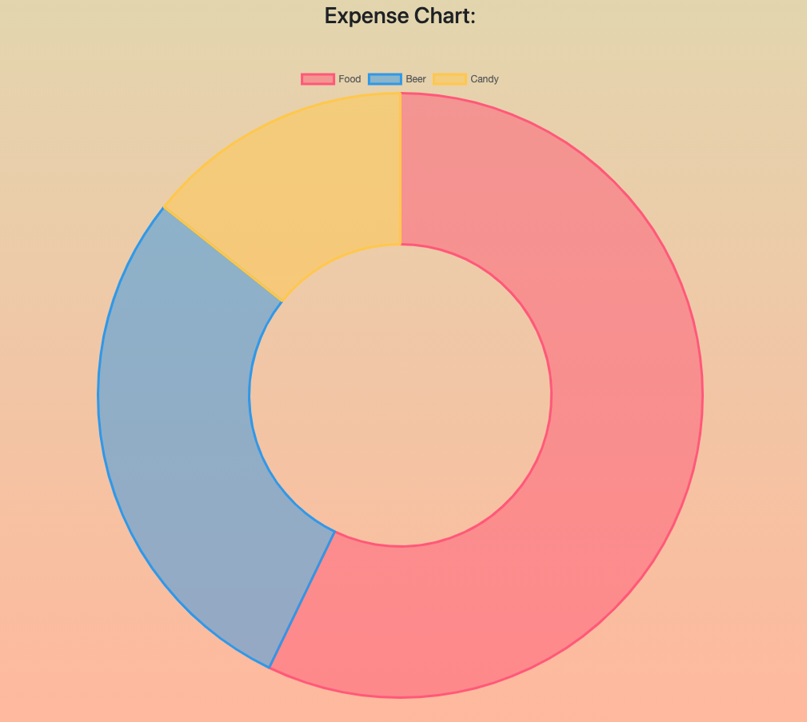

### Sugar Oppa (Full-Stack Web Project)

Team Members:
1. Bargavi Kanneganti
2. Dasom Huber
3. Heeyoung Song
4. Nina Kim

Languages/Technology:
- Bootstrap
- Express
- Postgre SQL
- Beekeeper

Site Walk-Through:
- The website, Sugar Oppa, is a fully functional budgeting tool that helps keep your finances in check. The main page is followed by two seperate pages: register page and login page. Once the user creates an account and logins in, they can start budgeting!

- The main page has two containers: the first one will input a budget value of the users choosing. For an example, the user's budget can be anything from $500 to $10,000 - and that will be set at the users primary budget. The budget can always be changed or altered - in case you come into more money or win the lottery!

- The second input will take in the user's chosen category (food, gas, beer, dog treats) and you can enter how much you intend to spent on these categories. The second container will also take in a date/time to remind them when the transaction was made. From there, the category amount will be deducted from your primary budget, and the user can always go back and delete these categories in case the user wants to make changes. 

- After the user has entered all the necessary components: budget, category, catgegory amount, and date/time - a colorful donut chart will appear below to show a visual representation of their transaction. 

-------------------------------------------

1. The website utilized Express for our HTTP framework by using mostly get, post, and delete when we needed to retrieve, send data back to the server, or delete. The get method is used to grab data from the server, the post method sends that data to the server and then creates it, while assigning that to the user that has logged in. The delete method was used to delete any input the user had added - in this case, the expenses and how much they were.
